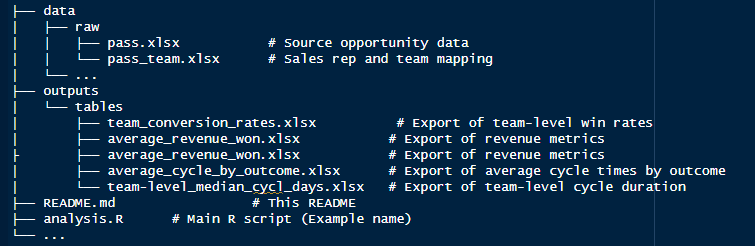

# SMB Sales Performance Analysis

## Overview

This repository contains an R-based workflow for cleaning, exploring, and analyzing sales opportunity data focused on a Small and Medium Business (SMB) sales team. The analysis aims to:

1.  Clean & Prepare the data for consistent reporting.

2.  Impute Missing Values, especially for date fields.

3.  Explore Key Metrics such as win/loss rates, deal sizes, and sales cycle.

4.  Identify Insights on SMB performance compared to other teams.

5.  Export Results (tables, charts) to inform business decisions.

## Repository Structure

-   **data/raw**: Contains the original data files (`pass.xlsx`, `pass_team.xlsx`).

-   **outputs/tables**: Contains the exported Excel files with various summary statistics.

-   **README.md**: Documentation about the project.

-   **smb_sales_analysis.R**: The core R script where data cleaning and analysis are performed.

## 🚀 R Environment Setup

1.  **Install R and RStudio** (if you haven’t already).

2.  **Ensure Required Packages** are installed. The script uses the `pacman` package for loading/installing dependencies:

\`\``install.packages("pacman")`\`\`\`

Load Dependencies\`\`p_load`("tidyverse", "lubridate", "janitor", "scales", "janitor", "openxlsx","ggtext", "showtext","patchwork","here","skimr","glue") source("R/analysis.R")`\`\`\`

> **Note:** The script automatically attempts to load/install these packages using `pacman::p_load()`.

------------------------------------------------------------------------

## Running the Analysis

1.  **Set Working Directory**:

    -   In the script, `setwd("C:/Users/User/OneDrive/Documents/smb_sales_analysis/data")` is used as an example.

    -   Adjust this path as needed, or use relative paths with `here::here()`.

2.  **Open `analysis.R`**:

    -   Run it line by line or in sections to execute the entire workflow.

3.  **Data Import**:

    -   The script reads `pass.xlsx` (opportunities) and `pass_team.xlsx` (sales reps) from `data/raw/`.

    -   `janitor::clean_names()` cleans columns; date parsing is done with `lubridate`.

4.  **Data Cleaning & Preparation**:

    -   Merge the `opportunities` and `sales_rep_team` data frames into `combined_pass_clean`.

    -   Factorize categorical columns (stage, team, owner, etc.).

    -   Handle missing `last_stage_change_date` values:

        -   If `stage == "NEW"` and missing date, set to `created_date`.

        -   For other stages, impute using median stage progression.

5.  **Exploratory Data Analysis**:

    -   Summaries generated with `skimr::skim()`.

    -   Histograms show distribution of employees.

    -   Missing value checks for `sold_price_per_registered_member`.

6.  **Key Metrics Computed**:

    -   **Win/Loss Rate**: Overall, by team (SMB vs. others).

    -   **Deal Size** (`sold_price_per_registered_member`): Average, median, total revenue.

    -   **Sales Cycle**: Time from `created_date` to `last_stage_change_date`.

7.  **Statistical Testing**:

    -   Fisher’s Exact / Chi-Square tests confirm significance of differences in win rates among teams.

    -   Spearman correlation for `employees` vs. `sales_cycle_days`.

8.  **Exporting Results**:

    -   Various summary tables are written to `xlsx` files under `outputs/tables/`:

        -   `team_conversion_rates.xlsx`

        -   `average_revenue_won.xlsx`

        -   `average_cycle_by_outcome.xlsx`

        -   `team-level_median_cycl_days.xlsx`

9.  **Visualization**:

    -   Bar chart showing conversion rate by team.

    -   Boxplot showing sales cycle duration by team and outcome.

------------------------------------------------------------------------

## Interpretation of Findings

1.  **SMB Performance**

    -   \~56% win rate, faster closure (\~4 days), higher average deal price (€35). Suggests the SMB approach is highly effective.

2.  **Other Teams**

    -   Ranges of 27%–46% conversion, often longer cycles. Some external teams show significantly slower closing times.

3.  **Missing Data**

    -   Many deals have `NA` for `sold_price_per_registered_member`, especially for non-closed stages or lost deals.

4.  **Recommended Actions**

    -   Scale or replicate SMB strategies, especially phone-based quick disqualification of low-potential deals.

    -   Enhance data capture for lost reasons and pricing structures.

    -   Deploy deeper analyses (e.g., logistic regression) for more predictive insights.

------------------------------------------------------------------------

## Troubleshooting & Notes

-   **Missing Packages**: If an error occurs, verify you have installed all required packages (e.g., `tidyverse`, `lubridate`, `janitor`, `here`, `openxlsx`, `skimr`, `infer`).

-   **File Paths**: Make sure to update `setwd()` and references to reflect your local file structure if you’re not using the same directory.

-   **Data Imputation**: The method used here is a **simplified** approach. In a real production environment, you should consult domain experts.

-   **Formatting**: Some factor conversions or column name transformations rely on consistent naming (e.g., “TEAM SMB” → “SMB”). Verify the input data is structured accordingly.

------------------------------------------------------------------------

## Next Steps

-   Incorporate more advanced analytics:

    -   Logistic regression to identify key drivers of Win vs. Lost.

    -   Time-series or funnel analysis to see stage-by-stage conversion. Actually, I did the funnel analysis. The Visualization will be added to the appendix slides.

    -   Evaluate churn or renewal rates for SMB vs. enterprise deals.

-   Share final deliverables with stakeholders (slides, PDF reports).

------------------------------------------------------------------------

## Contact

For questions or collaboration, reach out to **Etoma** at **you already know my email address :)**.

**Enjoy the SMB Sales Analysis workflow!**
